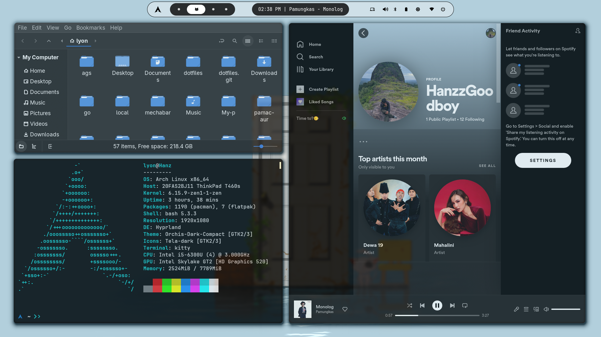
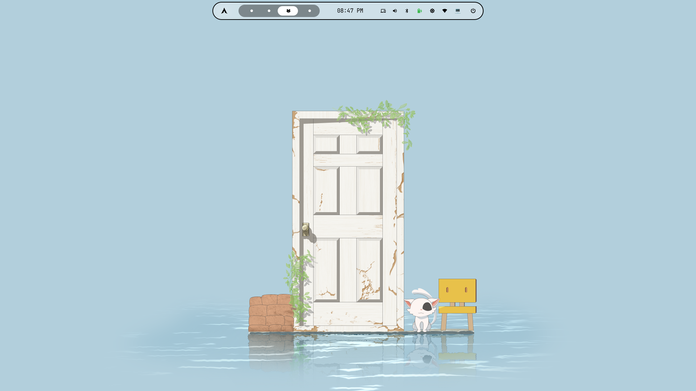

# 🛠 My Dotfiles - Jihan Nugraha

A collection of personal configurations for Linux (Hyprland, Waybar, and more).
This repo stores all the settings to make resetting your laptop/PC easy.

---

## 🖼 Preview

## 🖼 Performance

## 🖼 balance



---

## 📦 Features
- Aesthetic & lightweight Hyprland configuration
- Waybar with custom styles & smooth animations
- Themes, fonts, and icon packs
- Automatic installation script

---

## 🚀 How to Install

### 1️1. Clone this repo
```bash
git clone https://github.com/jihan431/my-dotfiles.git
cd my-dotfiles
```
### 2. Launch install script
```bash
chmod +x install.sh
./install.sh
```
